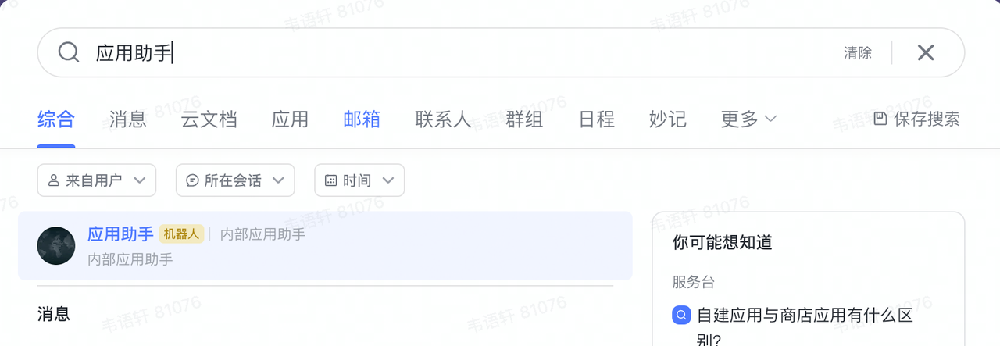
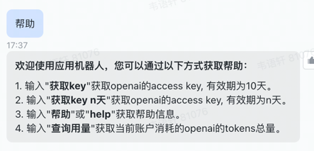
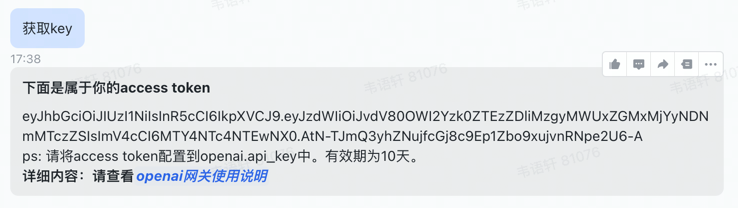
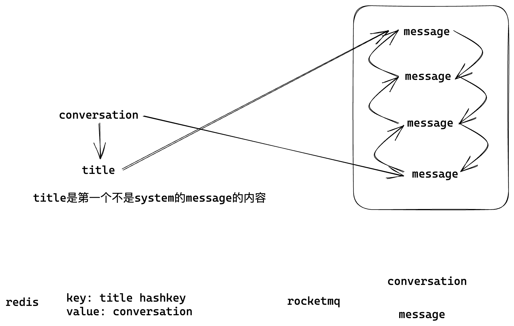

# openai-gateway配置相关信息
> 该项目为openai的网关，实现了对接飞书聊天机器人的oauth身份验证、多api_key配置筛选、openai转发、问答存储等功能。分为三个部分，网关、openai调用部分和mq消费者部分。
- auth：网关部分 
- openai：openai调用
- message：mq消费部分

## openai-gateway配置信息
### 镜像名称
swr.cn-north-4.myhuaweicloud.com/weizhanjun/openai-gateway:v1
### 配置信息：
- openai配置信息 
  - OPENAI_API_KEY: 配置openai的apikey数组，用逗号分开
  - OPENAI_PROXY: 暂时不用配置
- 服务配置信息
  - OPENAI_SERVICE_PORT:  服务启动端口，镜像里默认为8090
  - LOAD_BALANCER_RULE: "random"/"ip_hash"/"round_robin" 负载规则
  - RETRY_COUNT: 重试次数 默认是 3
  - RETRY_TIME: 重试时间 默认是1
  - SERVER_WORKERS是work数 默认是2
  - AUTH_SERVICE_URL: str = "http://127.0.0.1:8000" 当前地址（如果要使用通过网页来获取access token必须修改为服务器上真实的地址）
  - OPENAI_URL: str = "http://127.0.0.1:8080" openai服务的url
- 飞书相关配置信息
  - APP_ID: str =  飞书应用appid
  - APP_SECRET: str = 飞书应用密钥
- 数据库配置信息
  - DB_USER: str = "postgres" 数据库用户名
  - DB_PASSWORD: str = "123456" 数据库密码
  - DB_HOST: str = "127.0.0.1" 数据库地址
  - DB_PORT: str = "5432" 数据库端口
  - DB_NAME: str = "openai"数据库名称
- redis配置信息
  - REDIS_HOST: str = redis的host
  - REDIS_PORT: str = redis的port
  - REDIS_DB: int = 0 默认0
  - REDIS_USERNAME: str = 用户名 默认为空
  - REDIS_PASSWORD: str = 密码 默认为空
- rocket_mq配置
  - ROCKETMQ_NAME_SERVER: str = mq地址 类似于"120.48.73.227:9876"

### 数据库
数据表可以orm自己生成，创建数据库就行。
### 机器人消息请求地址配置
https://open.feishu.cn/app/xxxxxx(自己的飞书c_id)/event 在这个地址进行真实的配置。

### 机器人聊天获取认证信息
#### 1. 通过飞书应用助手（自己创建的机器人）获得access_token
- 在飞书中搜索应用助手，进入聊天框

- 输入「帮助」查看使用帮助

- 输入「获取key」获得有效期为10天的key， 输入「获取key n天」 获取有效期为n天的key。


#### 2. 使用access_token
将access_token填入openai.api_key
将网关地址/openai 填入openai.api_base
```python
openai.api_key = "刚才获得的access token"
openai.api_base = "网关地址"
result = openai.ChatCompletion.create(
    model="gpt-3.5-turbo", messages=[{"role": "user", "content": "Hello!"}]
)
```

#### 3. 实现了openai包以下的方法
openai.ChatCompletion.create(暂时没实现stream方法)
openai.Completion.create
openai.Embedding.create

### 认证网址（通过网页拿access token）
1. 需要选中【安全设置】一栏，并将接收授权码的页面地址添加到右侧的【重定向URL】
就是这个地址http://127.0.0.1:8090/auth/callback/openai 前半部分是服务器上真实的地址。

2. 然后让算法同学进入下面的地址
https://passport.feishu.cn/suite/passport/oauth/authorize?client_id=cli_a(自己的特征id)&redirect_uri=http://127.0.0.1:8090/auth/callback/openai&response_type=code

redirect_url设置为上面添加的重定向URLhttp://127.0.0.1:8090/auth/callback/openai 

3. 拿到token
4. 算法同学把access_token填入app_key访问即可，默认过期时间是10天
5. /auth/tokens 接口可以查看每个人的tokens用量

## 消费者配置信息
### 镜像名称
swr.cn-north-4.myhuaweicloud.com/weizhanjun/openai-message:v1

### 配置信息：
- 数据库配置信息
  - DB_USER: str = "postgres" 数据库用户名
  - DB_PASSWORD: str = "123456" 数据库密码
  - DB_HOST: str = "127.0.0.1" 数据库地址
  - DB_PORT: str = "5432" 数据库端口
  - DB_NAME: str = "openai"数据库名称
- rocket_mq配置
  - ROCKETMQ_NAME_SERVER: str = mq地址 类似于"120.48.73.227:9876"

## openai配置信息
### 镜像名称
swr.cn-north-4.myhuaweicloud.com/weizhanjun/openai:v1
### 配置信息：
OPENAI_PROXY: openai 代理 可以不填

## 项目功能介绍
- basic: 基础公共类
  - common: 公共类
    - env_variable: 环境变量类
    - exception: 自定义异常类
    - log: 日志类
  - utils: 工具类
    - load_balancer: 负载均衡工厂类
- services: 服务类
  - auth: 网关微服务
    - auth: 身份验证、api_key筛选、openai转发、问答存储
    - conversation: 查询数据库存储的completions、chat_completions、embeddings
    - message: 处理飞书机器人消息服务
    - util: 工具类，数据库，环境变量
    - Dockerfile: docker镜像文件打包当前微服务
  - openai: openai调用微服务
    - openai: 接口定制，异常捕获
    - Dockerfile: docker镜像文件打包当前微服务
  - message: 消息消费者微服务
    - message: 数据库映射类
    - main: rocketmq消息消费者类
    - Dockerfile: docker镜像文件打包当前微服务
- Dockerfile: docker镜像文件(打包基础类python第三方包，rocketmq的linux工具包)

## 项目实现
### chat_completes的conversation实现方式
通过对比第一个不是system的语句来判断是否是同一个conversation，如果是就把上一条的chat_completes的message_id放到当前的chat_completes的parent里面，如果不是就新建一个conversation。

